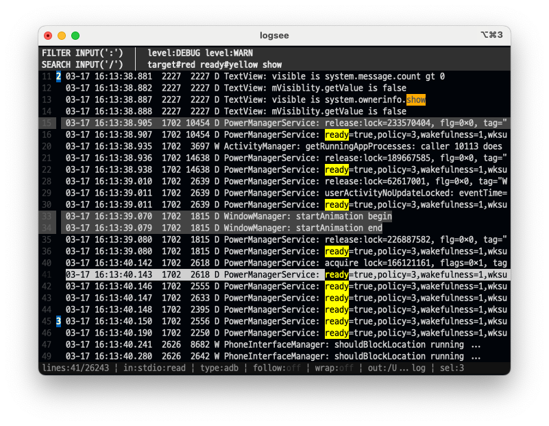

# logsee

터미널에서 로그를 탐색·필터·검색하는 TUI(Terminal User Interface) 도구입니다. 파이프로 들어오는 표준 입력(stdin)과 기존 로그 파일을 같은 화면에서 다룹니다.



## 빠른 시작

### 빌드 및 실행

```sh
make build
./bin/logsee --help
```

로컬 설치:

```sh
make publish-local   # ~/.local/bin/logsee
```

### 대표 사용 예

```sh
# 파이프 입력 — stdin을 파일에 저장한 뒤 그 파일을 기준으로 표시
some-command 2>&1 | logsee

# 저장 경로 지정
some-command 2>&1 | logsee --out session.log

# 파일 입력
logsee /var/log/syslog

# 로그 타입·설정 지정
logsee --log-type adb android.log
logsee --config ./config.toml kernel.log
```

### 테스트

```sh
make test-once
```

---

## 기능 목록


| #   | 기능                                       | 한 줄 요약                              |
| --- | ---------------------------------------- | ----------------------------------- |
| 1   | [입력 모드 (stdio / 파일)](#1-입력-모드-stdio--파일) | 파이프·파일 모두 지원, SOT 기반 표시             |
| 2   | [로그 타입 자동 판별](#2-로그-타입-자동-판별)            | `plain`, `adb`, `kernel` 자동·수동 선택   |
| 3   | [TUI 화면 구성](#3-tui-화면-구성)                | 필터·검색·목록·상태바 4구역                    |
| 4   | [로그 목록 탐색](#4-로그-목록-탐색)                  | 줄 이동, 페이지, Home/End, G              |
| 5   | [Follow 모드](#5-follow-모드)                | tail처럼 최신 로그 자동 추적                  |
| 6   | [필터](#6-필터)                              | `:` 진입, 토큰·태그·OR 문법                 |
| 7   | [검색](#7-검색)                              | `/` 진입, 하이라이트, n/p 이동, 색상 지정        |
| 8   | [북마크](#8-북마크)                            | 최대 9개, 숫자키 점프                       |
| 9   | [Wrap · 가로 스크롤](#9-wrap--가로-스크롤)         | 긴 줄 줄바꿈 또는 좌우 스크롤                   |
| 10  | [선택 · 클립보드 복사](#10-선택--클립보드-복사)          | Shift 구간, Space pick, `c` 복사        |
| 11  | [도움말 팝업](#11-도움말-팝업)                     | F1 / `?`, 목록 위 overlay, 스크롤         |
| 12  | [모드 스택 · Esc](#12-모드-스택--esc)            | 선택·검색 모드 단계적 취소                     |
| 13  | [설정 파일](#13-설정-파일)                       | `config.toml`, 로그 타입 패턴             |
| 14  | [CLI 옵션](#14-cli-옵션)                     | `--config`, `--log-type`, `--out` 등 |


---

## 기능별 상세 설명

### 1. 입력 모드 (stdio / 파일)

logsee는 두 가지 입력 경로를 지원합니다.


| 입력        | 예시                    | Source of Truth (SOT)        |
| --------- | --------------------- | ---------------------------- |
| **stdio** | `cmd 2>&1 | logsee`   | logsee가 만든 append-only 로그 파일 |
| **file**  | `logsee /path/to.log` | 사용자가 지정한 원본 파일               |


**stdio 동작**

- 표준 입력으로 들어온 줄은 **먼저 SOT 파일에 기록**되고, UI는 그 파일만 읽습니다.
- UI 메모리는 캐시일 뿐이며, 화면에 보이기 전에 SOT에 기록된 줄만 표시합니다.
- 기본 저장 파일명: `./logsee-YYYYMMDD-HHMMSS.log` (작업 디렉터리 기준)
- `--out`으로 저장 경로를 바꿀 수 있습니다.

**파일 동작**

- 원본 파일을 복사하지 않고 **파일 자체가 SOT**입니다.
- 대용량 파일도 전체를 메모리에 올리지 않고 **윈도우 단위**로 읽습니다.
- 줄 번호는 파일 기준 **1-based**입니다.

인자를 생략하거나 `-`를 주면 stdio, 경로를 주면 파일 입력으로 처리합니다.

---

### 2. 로그 타입 자동 판별

지원 타입:


| 타입       | 설명                       |
| -------- | ------------------------ |
| `plain`  | 일반 텍스트 로그                |
| `adb`    | Android logcat 계열        |
| `kernel` | Linux kernel / syslog 계열 |


**판별 방식 (`--log-type auto` 기본)**

1. SOT에서 비어 있지 않은 초기 N줄을 샘플링합니다 (`probe_lines`, 기본 200).
2. `config.toml`의 타입별 정규식 패턴과 매칭해 점수를 계산합니다.
3. 최고 점수 타입을 선택하고, 동률·무매칭이면 `plain`입니다.
4. 세션 중 타입은 **한 번 확정되면 변경하지 않습니다**.

CLI로 `--log-type plain|adb|kernel`을 지정하면 자동 판별을 건너뜁니다.

`level:` 필터는 로그 타입에 따라 심각도 추출 규칙이 달라집니다 (`adb`의 V/D/I/W/E/F, `kernel` bracket level 등).

---

### 3. TUI 화면 구성

화면은 위에서 아래로 **고정 4구역**입니다.

```
┌─ 필터 입력창 (1줄) ─────────────────┐
├─ 검색 입력창 (1줄) ─────────────────┤
├─ 로그 목록 (height - 3) ────────────┤  ← 커서, 북마크, 하이라이트, 선택
├─ 상태바 (1줄) ──────────────────────┤
└─────────────────────────────────────┘
```

**로그 한 줄 형식**

```text
<줄번호> <북마크번호> <로그 본문>
```

- 줄 번호: SOT 기준 1-based
- 북마크: `1`–`9` 또는 공백(폭 고정)
- 커서 행은 reverse 등으로 강조

**상태바 필드** (예: `lines:120/9834 | in:stdio:read | type:adb | follow:on | wrap:off | out:session.log | bm:1,3 | sel:2 | msg:3 lines copied`)


| 필드       | 의미                            |
| -------- | ----------------------------- |
| `lines`  | 현재 커서 줄 / 전체 줄 수              |
| `in`     | `stdio`/`file` + `read`/`eof` |
| `type`   | 확정 로그 타입 (`auto~`는 판별 전)      |
| `follow` | follow on/off                 |
| `wrap`   | wrap on/off                   |
| `out`    | stdio SOT 경로 (파일 입력이면 `-`)    |
| `bm`     | 북마크 번호 목록                     |
| `sel`    | 선택된 줄 수 (있을 때만)               |
| `msg`    | 복사 결과 등 짧은 피드백                |


도움말이 열리면 **목록 영역 위에 modal overlay**로 겹쳐 표시되며, 필터·검색·상태바는 그대로입니다.

---

### 4. 로그 목록 탐색

로그 목록에 포커스가 있을 때 사용하는 이동 키입니다.


| 키                                          | 동작                                   |
| ------------------------------------------ | ------------------------------------ |
| `j` / `k`, `↑` / `↓`                       | 한 줄 아래 / 위                           |
| `PageDown` / `PageUp`, `Ctrl+F` / `Ctrl+B` | 한 페이지 아래 / 위 (커서가 화면 끝·시작에 있을 때 스크롤) |
| `Home` / `End`                             | 목록 처음 / 끝                            |
| `G`                                        | **마지막 출력 줄**로 이동 + **follow 켜기**     |
| `n` / `p`                                  | 검색 기준 다음 / 이전 매칭 줄 ([검색](#7-검색) 참고)  |
| `1`–`9`                                    | 해당 번호 북마크로 이동 ([북마크](#8-북마크) 참고)     |


커서는 항상 화면 안에 보이도록 스크롤이 따라갑니다. 범위를 벗어나는 이동은 가능한 가장 가까운 유효 위치로 clamp합니다.

---

### 5. Follow 모드

**tail 모드**와 같습니다. 새 로그가 SOT에 기록되면:

- **follow on**: 커서와 화면이 **마지막 출력 줄**에 고정됩니다.
- **follow off**: 새 로그가 와도 화면은 자동으로 움직이지 않습니다.


| follow 켜짐                                 | follow 꺼짐                           |
| ----------------------------------------- | ----------------------------------- |
| `G`, 마지막 줄로 이동하는 `j`/`↓`/`PageDown`/`n` 등 | `k`/`↑`/`PageUp`/`Home`/`p` 등 위쪽 이동 |


상태바 `follow:on`은 강조색, `follow:off`는 낮은 대비로 표시합니다.

stdio·증가하는 파일 입력 모두, SOT 갱신 시 follow on이면 자동으로 끝을 따라갑니다.

---

### 6. 필터

**진입**: 로그 목록에서 `:` (콜론만, `Enter`는 필터 진입에 사용하지 않음)

**적용**: `Enter` — 파싱 성공 시 목록을 줄이고, 실패 시 **기존 필터 유지** + 입력창에 오류 표시

**취소 편집**: `Esc` — 편집 중인 값만 버리고 목록으로 복귀 (적용된 필터는 유지)

**히스토리**: `Down` — 최근 적용한 필터 문자열 목록(최대 10개) 오버레이. `j`/`k`·`↑`/`↓`로 이동, `Enter`로 입력창에 채움, `Esc`/`F1`로 닫기. 항목이 없으면 `(no history)` 표시.

**포커스 이동**: 검색 입력창은 로그 목록에서 `/`로 진입하거나, 검색창에서 `Up`으로 필터로 이동.

필터는 **표시할 줄 집합**만 바꿉니다. 검색 문자열은 지우지 않으며, 검색·`n`/`p`는 **필터를 통과한 줄 안에서만** 동작합니다.

#### 필터 문법 요약

**토큰화**

- 공백/탭으로 분리
- `"..."` 로 공백 포함 토큰
- `tag:` 다음 토큰이 `:`/`|` 없으면 값과 병합 (`over_speed:` `false` → `over_speed: false`)

**토큰 종류**


| 종류    | 예                              | 의미                      |
| ----- | ------------------------------ | ----------------------- |
| 단순 포함 | `timeout`, `+timeout`          | 줄 전체에 문자열 포함            |
| 단순 제외 | `-retry`                       | 해당 문자열 포함 시 제외          |
| 태그    | `level:ERROR`, `-service:prod` | `tag:value` KV 또는 예약 태그 |
| OR    | `|`                            | 가지(branch) 중 하나라도 만족    |


**결합**

- 서로 다른 조건: AND
- 같은 태그의 여러 `+` 값: OR
- 같은 태그의 `-` 값: 하나라도 맞으면 제외
- 최상위 `|`: OR 가지 (빈 가지·`||` 는 오류)

**예약 태그 `level`**

- `adb` / `kernel` 에서 로그 형식에 맞게 level 추출 후 비교
- `plain` 에서는 `level:` 필터가 추출 실패로 동작하지 않음

**대소문자**

- 기본: 구분
- `--ignore-case`: **필터만** 대소문자 무시 (검색 하이라이트·`n`/`p`에는 미적용)

**예시**

```text
timeout retry              # timeout AND retry
timeout -retry             # timeout, retry 제외
level:ERROR level:WARN     # ERROR OR WARN
service:prod err | service:prod warn   # OR 가지
"over_speed: false"        # 공백 포함 태그 값
```

---

### 7. 검색

**진입**: 로그 목록에서 `/`

**적용**: `Enter` — 현재 검색 문자열로 하이라이트·`n`/`p` 기준 갱신

**취소 편집**: `Esc` — 적용된 검색은 유지, 편집 버퍼만 폐기 후 로그 목록으로 복귀

**히스토리**: `Down` — 최근 적용한 검색 문자열 목록(최대 10개) 오버레이. 조작은 필터 히스토리와 동일.

**포커스**: `Up` → 필터 입력창. 로그 목록으로는 `Esc`로 복귀.

검색은 **목록을 줄이지 않습니다**. 필터를 통과한 줄 위에서만 매칭·강조합니다.

#### 검색 토큰

- 공백/탭으로 다중 토큰
- `"..."` 로 공백 포함 토큰
- 한 줄에 **토큰 중 하나라도** 부분 일치하면 매칭
- 하이라이트는 **대소문자 구분** (항상)
- `n` / `p`: 현재 커서 기준 다음/이전 매칭 (순환 없음, 없으면 상태바 `no match`)

#### 검색어 색상 (`검색어#색상`)

토큰 뒤에 `#색상`을 붙이면 해당 토큰 하이라이트 배경색을 지정합니다.

```text
error#red timeout#green "my error"#yellow
```

지원 색상 이름: `red`, `green`, `blue`, `yellow`, `cyan`, `magenta`, `white`, `black`, `orange`, `purple`, `pink`

색상을 생략하면 기본 강조(주황 계열)를 사용합니다. 같은 줄에서 겹치는 구간은 **같은 색끼리만** 병합합니다.

#### 히스토리 저장 · 시작 시 복원

- 필터 히스토리와 검색 히스토리는 서로 독립하며, 각각 최대 10개의 서로 다른 문자열을 유지합니다.
- 저장 경로: `$HOME/.local/logsee/input_history.json`
- 뷰어 시작 시 마지막 필터·검색 문자열을 각각 복원합니다. 필터는 기존 파싱 규칙을 따르며, 파싱에 실패하면 적용하지 않고 오류만 표시합니다.
- `Enter`로 성공 적용할 때마다 해당 채널에 기록·저장합니다. 빈 문자열은 기록하지 않으며, 동일 문자열을 다시 적용하면 최신 위치로 올립니다.

---

### 8. 북마크


| 키       | 동작                          |
| ------- | --------------------------- |
| `m`     | 현재 커서 줄에 북마크 추가 / 이미 있으면 해제 |
| `1`–`9` | 해당 번호 북마크 줄로 이동 (목록에 보일 때만) |


- 최대 **9개**, 번호는 부여 순서대로 1–9 (취소해도 다른 번호는 재배열하지 않음)
- 9개가 찬 뒤 북마크 없는 줄에서는 `m` 무시
- 북마크로 이동하면 follow는 꺼짐
- 필터·검색 입력 중에는 `m`·숫자키가 북마크로 동작하지 않음

목록에는 북마크 번호가 배지 형태로 표시됩니다.

---

### 9. Wrap · 가로 스크롤


| 키   | 동작                |
| --- | ----------------- |
| `w` | wrap 모드 ON/OFF 토글 |


**wrap off (기본에 가까운 동작)**

- 긴 본문은 화면 폭 한 줄로 자름
- `h` / `l`: 로그 **본문만** 좌우 스크롤 (줄 번호·북마크·선택 표시는 고정)
- 스크롤 offset은 **화면 전체에 동일** 적용

**wrap on**

- 화면 폭에 맞춰 여러 visual row로 표시
- 이어지는 줄은 들여쓰기만 하고 줄 번호·북마크는 반복하지 않음

입력창 포커스일 때 `w`는 문자 입력으로 처리됩니다.

---

### 10. 선택 · 클립보드 복사

로그 목록 포커스에서만 동작합니다.

#### 클립보드 의존성 (OS별)

`c`로 복사할 때 logsee는 OS에 맞는 **외부 명령**으로 클립보드에 씁니다. Go 라이브러리 추가 설치는 필요 없습니다.


| OS        | 사용 명령        | 추가 설치                                                                        |
| --------- | ------------ | ---------------------------------------------------------------------------- |
| **macOS** | `pbcopy`     | **불필요** — `/usr/bin/pbcopy`가 기본 포함                                           |
| **Linux** | `xclip`      | **필요** — 예: `apt install xclip` / `dnf install xclip` / `brew install xclip` |
| 기타        | `xclip` (시도) | 해당 OS에 `xclip` 또는 호환 도구 설치                                                   |


macOS에서 `clipboard error`가 나오면:

1. 터미널에서 `which pbcopy` — `/usr/bin/pbcopy` 등이 보여야 합니다.
2. SSH/원격 세션에서는 로컬 Mac 클립보드 연동이 안 될 수 있습니다 (터미널·SSH 클라이언트 설정 확인).
3. Linux에서 macOS 바이너리를 실행 중이면 `xclip`이 없어 실패합니다 — **macOS용 빌드**를 사용하세요 (`GOOS=darwin` 또는 Mac에서 `make build`).

Linux에서 복사가 실패하면 `xclip` 설치 후 다시 시도하세요.

**연속 구간 선택**


| 키                          | 동작          |
| -------------------------- | ----------- |
| `Shift+↑` / `Shift+↓`      | 앵커~커서 구간 선택 |
| `Shift+Home` / `Shift+End` | 앵커~처음/끝 구간  |


일반 이동(`j`/`k`/Page/Home/End/`n`/`p`)은 **활성 구간 표시만** 해제하고, 이미 pick된 줄은 유지할 수 있습니다.

**Space pick**

- `Space`: 현재 커서 줄 토글
- 활성 연속 구간이 있을 때 `Space`: 구간을 pick 상태로 유지한 뒤 현재 줄 토글

**복사**


| 키   | 동작                                               |
| --- | ------------------------------------------------ |
| `c` | 연속 구간 ∪ Space pick을 **raw 줄 번호 오름차순**으로 클립보드에 복사 |


- 선택이 없으면 **현재 커서 한 줄**만 복사
- 성공: 상태바 `N lines copied` / `1 line copied` (잠시 후 사라짐)
- 대상 없음: `no lines`

필터·검색 입력 중 `Space`/`c`/Shift는 텍스트 입력으로 처리됩니다.

---

### 11. 도움말 팝업


| 키     | 동작                          |
| ----- | --------------------------- |
| `F1`  | 필터·검색·목록 **어디서나** 도움말 열기/닫기 |
| `?`   | **로그 목록**에서만 도움말 열기/닫기      |
| `Esc` | 도움말만 닫기 (모드 스택은 유지)         |


- 목록 영역 전체에 **반투명 overlay** (`─ Help ─` 제목)
- 본문이 길면 **도움말 전용 스크롤**: `j`/`k`, `↑`/`↓`, `PageUp`/`PageDown`, `Ctrl+B`/`Ctrl+F`, `Home`, `End`
- 도움말이 열린 동안 로그 커서·필터·검색·선택 상태는 **변경하지 않음**
- 필터·검색 입력창에서 `?`는 **일반 문자**

---

### 12. 모드 스택 · Esc

로그 목록은 **선택 모드**와 **검색 모드**를 스택으로 관리합니다.


| 모드 push 조건             | pop 시 (`Esc`)      |
| ---------------------- | ------------------ |
| 연속 구간 또는 Space pick 존재 | 선택 정보 전부 clear     |
| 적용된 검색 문자열 비어 있지 않음    | 검색 문자열·입력 버퍼 clear |


- 선택·검색이 둘 다 있으면 `Esc`마다 **하나씩** pop
- 검색 입력창에서 `Esc`: 편집만 취소, **적용된 검색 유지**
- 도움말 열림 상태의 `Esc`: 도움말만 닫음
- `:` / `/` 로 입력창 진입 시 선택은 clear
- 필터 `Enter` 적용 성공 시 선택 clear

**종료**


| 키        | 동작         |
| -------- | ---------- |
| `q`      | 로그 목록에서 종료 |
| `Ctrl+C` | 어디서나 종료    |


---

### 13. 설정 파일

기본 경로: `$HOME/.local/logsee/config.toml`

우선순위: **CLI 옵션** > **config.toml** > **내장 기본값**

```toml
[log_type]
default = "auto"
probe_lines = 200

[log_type.patterns]
plain = []
adb = [
  '''^\d{2}-\d{2}\s+\d{2}:\d{2}:\d{2}\.\d+\s+\d+\s+\d+\s+[VDIWEF]\s+''',
]
kernel = [
  '''^\[[\s\d.]+\]\s+''',
]
```


| 항목                         | 설명                               |
| -------------------------- | -------------------------------- |
| `log_type.default`         | `auto`, `plain`, `adb`, `kernel` |
| `log_type.probe_lines`     | 자동 판별 샘플 줄 수                     |
| `log_type.patterns.<type>` | 타입별 판별 정규식 목록                    |


잘못된 정규식은 설정 로드 실패로 처리합니다.

---

### 14. CLI 옵션

```text
logsee [options] [input-file|-]
```


| 옵션                                   | 설명                 |
| ------------------------------------ | ------------------ |
| `--config <path>`                    | 설정 파일 경로           |
| `--log-type <auto|plain|adb|kernel>` | 로그 타입 강제           |
| `--out <path>`                       | stdio SOT 출력 파일 경로 |
| `--ignore-case`                      | 필터·태그 비교 시 대소문자 무시 |
| `--version`                          | 버전 출력 후 종료         |


| 인자          | 설명                 |
| ----------- | ------------------ |
| (없음) 또는 `-` | stdin에서 읽기 (stdio) |
| `경로`        | 해당 파일을 SOT로 열기     |


---

## 키맵 요약 (로그 목록)


| 영역    | 주요 키                                           |
| ----- | ---------------------------------------------- |
| 이동    | `j` `k` `↑` `↓` `PgUp` `PgDn` `Home` `End` `G` |
| 검색 이동 | `n` `p`                                        |
| 필터    | `:` 입력창, `Enter` 적용                            |
| 검색    | `/` 입력창, `Enter` 적용                            |
| 북마크   | `m`, `1`–`9`                                   |
| 표시    | `w` wrap, `h` `l` 가로 스크롤                       |
| 선택    | `Shift+방향`, `Space`, `c`                       |
| 기타    | `F1` `?` 도움말, `Esc` 모드/도움말, `q` 종료             |


앱 안에서 `?`(목록) 또는 `F1`으로 전체 키맵을 볼 수 있습니다.

---

## 아키텍처 · 문서

- 요구사항 기준: `[PRD.md](PRD.md)`
- Epic·진행: `[docs/epics/](docs/epics/)`, `[PLAN.md](PLAN.md)`, `[PROGRESS.md](PROGRESS.md)`
- 에이전트 워크플로: `[AGENTS.md](AGENTS.md)`

Go 1.22+, [Bubble Tea](https://github.com/charmbracelet/bubbletea) 기반 TUI입니다. Clean Architecture 방향으로 `cmd` → adapter → usecase → domain 구조를 따릅니다.

---

## 라이선스

저장소 루트의 라이선스 정책을 따릅니다. 별도 `LICENSE` 파일이 없으면 프로젝트 관리자에게 확인하세요.