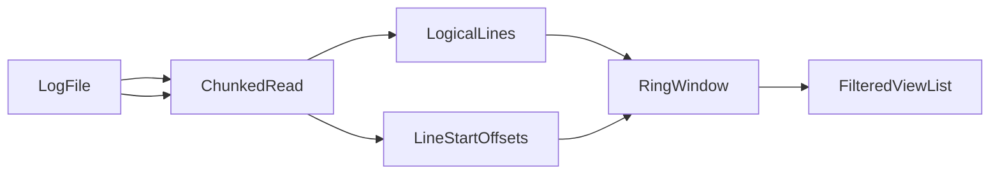
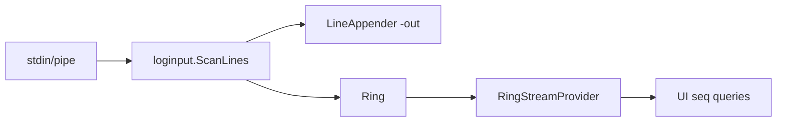

# Log read pipeline (파일 입력 + stdin 스트림)

## Why

positional **로그 파일**은 전체를 한 번에 메모리에 올리지 않고, 디스크에서 **청크 단위로 읽고** 논리 줄을 복원한 뒤, 화면에 맞는 **슬라이딩 윈도우**만 [`buffer.Ring`](../../internal/buffer/ring.go)에 둔다. PRD §4.1([`docs/plans/stdio-log-viewer-prd.md`](../plans/stdio-log-viewer-prd.md))과 동일한 목표다.

**stdin 스트림**은 과거엔 별도 코드 경로로 다뤘지만, [`docs/plans/stdin-fileprovider-unify-plan.md`](../plans/stdin-fileprovider-unify-plan.md)의 tee 모델 적용 이후 **단일 `WindowProvider` 추상**으로 통합되었다. 두 경로 모두 `Ring + WindowProvider` 쌍을 채우고, UI 는 provider 인터페이스 뒤에서 임의 접근 윈도우 조회를 수행한다.

## 상위 흐름

## 디스크 읽기: 버퍼 크기

| 용도 | 버퍼 | 구현 |
|------|------|------|
| 전 파일 **줄 시작 바이트 오프셋** 테이블 | **4 KiB** | [`loginput.LineStartOffsets`](../../internal/loginput/scan.go) |
| 논리 줄 **텍스트** 복원(부트스트랩·윈도우 로드) | **8 KiB** | [`loginput.ScanLines`](../../internal/loginput/scan.go) — `ReadFirstNLines`, `ReadWindowRecords` 경로 |

PRD의 “4 KiB 청크”는 **인덱스(오프셋) 스캔**에 해당한다. 줄 내용을 읽을 때는 `ScanLines`가 8 KiB 버퍼를 쓴다.

줄 경계 규칙(LF, CRLF, 단독 CR 등)은 `ScanLines`와 `LineStartOffsets`가 동일하다.

## 엔트리: `main`의 병렬 작업

[`cmd/logsee/main.go`](../../cmd/logsee/main.go)에서 `fromFile`일 때:

1. **인덱스**: `fileindex.BuildLineStartOffsets(path)` → `LineStartOffsets`로 전 스캔 → `FileIndexReadyMsg{Offsets}`.
2. **초기 윈도우**: `fileindex.ReadFirstNLines(path, 42)` → 파일 앞에서 최대 42줄 → `FilePartialBootstrapMsg{Lines}`.

두 고루틴은 `tea.Program.Send`로 비동기 전달되므로, 인덱스와 부트스트랩 완료 순서는 보장되지 않는다. 초기 화면은 부트스트랩만으로도 뜨고, 스크롤이 로드 범위 밖으로 나가려면 오프셋 테이블이 필요하다.

## 슬라이딩 윈도우 (메모리)

- **초기**: [`applyFilePartialBootstrap`](../../internal/ui/file_partial.go)이 `Record{Seq: 1-based 줄 번호}`로 채운 뒤 `Ring.ReplaceRecords`.
- **이동**: 뷰포트 밖 탐색 시 `cmdLoadFileWindowAround` 등이 `fileindex.ReadWindowRecords`를 호출 — `Seek`으로 줄 시작으로 이동 후 `ScanLines`로 필요한 줄만 읽음 → `FileWindowLoadedMsg` → `applyFileWindowLoaded` → 다시 `ReplaceRecords`.
- **크기**: 대략 **2 × viewport 높이** 줄(`cmdLoadFileWindowAround`의 `win := 2 * vh`).

파일 모드에서 `Seq`는 파일 내 **고정 1-based 줄 번호**이며, stdin 모드의 도착 순서 `Seq`와 의미가 다르다(PRD §4.1).

## 화면 목록까지

- 데이터는 항상 `Model`의 `m.buf`(`Ring`)에 담긴 `domain.Record`다.
- 필터·검색은 `filteredIndices()` 등으로 버퍼 위 인덱스를 거친 뒤, 커서·스크롤·wrap과 함께 `View`에서 리스트로 렌더된다.
- 파일 모드에서 `applyIncomingLines`는 적용되지 않는다(`filePartial`이면 early return).

## 뷰 상태 좌표계 (Seq primary)

파일 부분 로딩 모드에서 뷰 상태는 **파일 절대 좌표(1-based Seq)**를 source of truth로 삼는다. Ring은 Seq 범위의 **캐시**일 뿐이며, `ReplaceRecords`로 버퍼가 교체되어도 뷰 상태는 변하지 않는다.

| 필드 | 역할 |
|------|------|
| `cursorSeq` | 현재 목록에서 커서가 가리키는 줄의 Seq (필터 통과 줄). |
| `viewTopSeq` | 뷰포트 최상단(또는 가시 첫 필터 매치) 줄의 Seq. |
| `scrollTop`·`cursorIdx` | 렌더 시점에 `(cursorSeq, viewTopSeq)`로부터 `fidx`에서 유도되는 **파생 값**. |

불변식:
- 버퍼 교체 전후로 `(cursorSeq, viewTopSeq)`가 동일하면 화면 내 커서 row도 동일.
- 앵커 Seq가 새 fidx에 없으면 **`preferBottom` 추론**(`viewTopSeq < cursorSeq`)으로 fallback: bottom pin이면 마지막 fidx row, top pin이면 첫 fidx row.

cmd 함수 규약 (호출자가 의도를 seq 앵커로 표현):
- `cmdLoadFileWindowAroundBottom(seq, vh)`: `cursorSeq=seq`, `viewTopSeq = seq - (vh-1)` → bottom pin.
- `cmdLoadFileWindowAroundTop(seq, vh)` / `StartingAt(first)` / bookmark / top-nav: `cursorSeq = seq`, `viewTopSeq = seq` → top pin.
- `cmdLoadFileWindowAround(seq)`: cursorSeq만 갱신, viewTopSeq는 호출자(nav 핸들러)가 설정한 값 유지.

구현: 자세한 단계는 [`docs/plans/seq-coord-pull-window-plan.md`](../plans/seq-coord-pull-window-plan.md). 종래의 `stickyFileScrollPin`·`pendingFocusSeq`·`pendingFocusPreferBottom` 필드/함수는 Seq 앵커로 완전히 대체되어 제거됐다.

### 필터 모드의 경계 nav (§8.0 layer 1 + Seq 좌표)

필터가 활성일 때 `j`/`k`로 마지막/첫 번째 **매치** 줄을 넘어가려 하면 `cmdLoadFileWindowAround(G±1)`은 잘못된 선택이다 — `G±1`은 대부분 필터 통과 안 하기 때문에 새 fidx에 없고, `cursorSeq` 앵커가 미스 → fallback으로 첫 매치 줄(top row)로 튀어버린다. 사용자가 보고한 "다음 매치가 아니라 이전 매치(108)로 점프 + 상단 이동"이 이 원인.

해결: 필터 모드에서 nav boundary는 **filter-scan 경로로 위임**한다. `filterTopupNavAdvance`는 의도된 step 수:
- `j` 경계 → `+1`, `k` 경계 → `-1`.
- `PageDown` 경계 → `+vh`, `PageUp` 경계 → `-vh`.

`FilterScanResultMsg` 처리에서 `filterTopupNavAdvance`가 세팅되어 있으면:
1. 새 fidx에서 `focusSeq` 기준 그 이후(+)/이전(-) 매치를 앞에서부터 세면서 최대 `|advance|`개까지 이동. cursor를 consumed한 마지막 매치로 설정.
2. 전부 소비(`advanced == remaining`) → `filterTopupNavAdvance=0`, 체인 종료.
3. 부분 소비 → `remaining -= advanced`로 갱신, 같은 방향으로 scan 체인 계속(EOF이면 현재 위치 유지·state 클리어).

이 규약이 PageUp 시 "vh개 매치 뒤로" 의도를 그대로 전달하며, 새 창 로드가 raw seq 기반일 때 발생하던 "padding 때문에 cursor가 화면 중간에 보이는" 회귀를 제거한다.

## stdin 스트림 경로 (tee 모델)

stdin 입력은 다음처럼 동작한다:

1. `loginput.ScanLines` 가 stdin 을 읽어 `LineMsg` / `LineBatchMsg` 로 UI 에 전달.
2. `applyIncomingLines` ([`model_update.go`](../../internal/ui/model_update.go)) 가 각 줄을 (옵션 `-out` 경로로 append) → `Ring.Push` → `RingStreamProvider.NoteReceived(n)`.
3. UI 는 `m.windowProvider`(stdin 시작 시 `NewRingStreamProvider(ring)` 로 주입됨) 를 통해 seq 범위 조회를 수행. `Ring` 은 물리 스토어, provider 는 **누적 수신 카운터** 를 노출 (ring 용량 초과 evict 와 무관하게 단조 증가).

- `RingStreamProvider.Fetch(first, last)`: ring 에서 `Seq ∈ [first,last]` 인 레코드만 복사 반환. ring 에서 evict 된 seq 는 결과에서 자연 누락 — 현 stdin scrollback horizon 과 동일 의미.
- `RingStreamProvider.TotalLines()`: 누적 수신 카운터. status strip `lines:N/M` 의 분모로 쓰인다 (ring evict 후에도 정확).
- `RingStreamProvider.FileSize()` / `EstimateBytes()`: 0. 스트림은 바이트 주소 지정이 불가하며, disk-scan 바이트 가드(PRD §4.1)는 file 전용.

stdin 경로의 **랜덤 액세스 한계**: 링 용량을 벗어난 과거 라인은 현재 조회 불가. `-out` 파일에서 다시 읽는 disk-fallback 계획은 [`docs/plans/scrollback-disk-fallback.md`](../plans/scrollback-disk-fallback.md).

## 공통: WindowProvider 인터페이스

| 메서드 | 파일 경로 (`FileSliceProvider`) | stdin 경로 (`RingStreamProvider`) |
|--------|-------------------------------|-----------------------------------|
| `Fetch(first, last)` | `fileindex.ReadWindowRecords` (seek + ScanLines) | ring 슬라이스 복사 |
| `TotalLines()` | `len(offsets)` | 누적 수신 카운터 (atomic) |
| `FileSize()` | 바이트 크기 | 0 |
| `EstimateBytes(first, last)` | offsets 차분 (disk guard 에 사용) | 0 |

[`internal/ui/window_provider.go`](../../internal/ui/window_provider.go) 참조.

## 관련 파일

| 역할 | 파일 |
|------|------|
| 청크 읽기·줄 파싱 | [`internal/loginput/scan.go`](../../internal/loginput/scan.go) |
| 오프셋/윈도우 읽기 API | [`internal/fileindex/window.go`](../../internal/fileindex/window.go) |
| 부분 로딩 메시지·명령 | [`internal/ui/file_partial.go`](../../internal/ui/file_partial.go) |
| WindowProvider 추상 + stdin 구현 | [`internal/ui/window_provider.go`](../../internal/ui/window_provider.go) |
| stdin 배치 수신 | [`internal/ui/model_update.go`](../../internal/ui/model_update.go) (`applyIncomingLines`) |
| 링 교체·stdin Push | [`internal/buffer/ring.go`](../../internal/buffer/ring.go) |
| 메시지 처리 진입 | [`internal/ui/model.go`](../../internal/ui/model.go) (`FilePartialBootstrapMsg`, `FileIndexReadyMsg`, `FileWindowLoadedMsg`, `LineMsg`, `LineBatchMsg`) |
