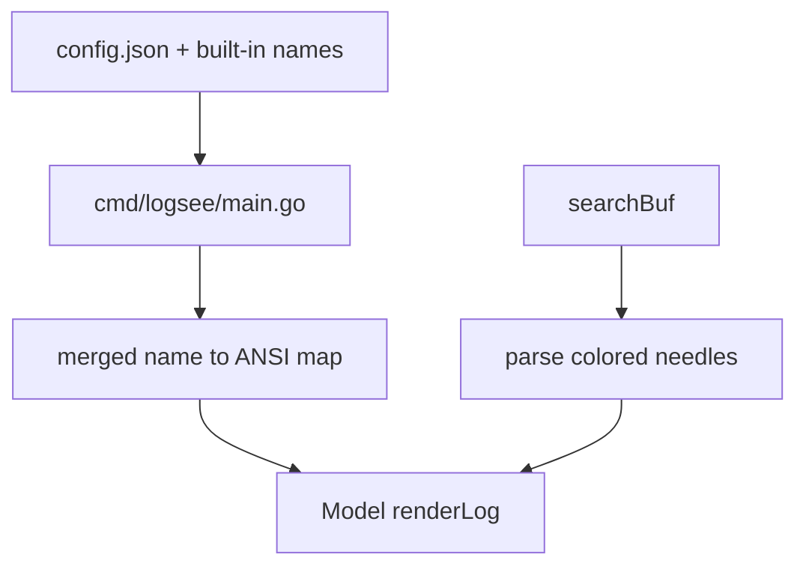

# Highlight 멀티컬러 — 확정 스펙 및 구현 계획

## 목표

- **다중 키워드 멀티컬러**: 한 적용 검색어 안에서 키워드마다 서로 다른 **배경색**만 지정.
- **문법 (ANSI256)**: `"foo"#214` — `#` 뒤에 0–255.
- **이름 색**: `"foo"#red — **미리 정의된 이름** → ANSI256으로 해석.
- **내장 팔레트**: 기본 색 이름을 코드에 상수로 제공.
- **사용자 팔레트**: `config.json`에 **이름 → ANSI256** 매핑을 두어 내장 이름을 보강/덮어쓰기.

## 현재 코드와의 관계

- 단일 `hi` 스타일: [internal/ui/model.go](../../internal/ui/model.go) `renderLog()`의 214/0 고정.
- 단일 구간 병합: [internal/ui/highlight.go](../../internal/ui/highlight.go) `mergedMatchIntervals` + `Highlight` / `HighlightWithReverseStyles`.
- 설정: [internal/config/config.go](../../internal/config/config.go) — `Config` 확장 + `merge`/`validate` + `Default()`.

## 문법 상세

### 토큰 형태

- **색 있는 키워드**: `"…"` (필터와 동일한 따옴표 규칙) 직후 **공백 없이** `#`, 그 다음
  - **숫자**: `0`–`255`, 또는
  - **이름**: ASCII 식별자 (예: `[a-zA-Z][a-zA-Z0-9_]*`).
- **색 없음 (하위 호환)**: PRD §8.2와 같이 공백 분리 토큰만 있으면 각 토큰은 **기본 하이라이트 배경**(현재 214에 해당)으로 칠함. `"foo"#214 bar` 처럼 **유색 + 무색 혼합** 가능.

### 겹침 구간

- 겹침 시 **적용 검색어에서 뒤에 나온 토큰이 우선**(paint last wins)으로 구간을 분해해 칠함.

### 파싱 실패

- 잘못된 숫자 범위·미정의 이름: 구현 시 **한 가지**로 통일 (예: 해당 토큰만 스킵 + 경고).

## Config (JSON)

- 필드명 예: `highlight_color_names`: `{ "red": "196", "warn": "214" }`.
- **병합**: 내장 기본 맵 → `config.json` (**동일 키는 config 우선**).
- **검증**: 값이 0–255 범위 표현인지 확인.

## 렌더링

- **배경만 사용자 지정**; **전경**은 가독성을 위해 **단일 기본**(예: 검정 계열) 유지.
- **커서 줄 reverse**: `HighlightWithReverseStyles`를 구간별 BG를 받을 수 있게 일반화.

## 데이터 흐름

## 손댈 파일

| 영역 | 파일 |
|------|------|
| 문법·다색 렌더 | `internal/ui/highlight.go`, `highlight_test.go` |
| UI·커서 경로 | `internal/ui/model.go` |
| 설정 | `internal/config/config.go`, `config_test.go` |
| 주입 | `cmd/logsee/main.go` |
| 문서 | `docs/plans/stdio-log-viewer-prd.md` §8.2–8.3, `README.md` |

## 테스트

- **config**: 병합·검증.
- **highlight**: 단일/다중 occurrence, 겹침 우선순위, 무색+유색 혼합.
- **model**: 커서/reverse/selected 경로.

## 하위 호환

- `#` 없는 기존 검색어는 기본 단일 BG로 동일 동작.
- `state.json` 문자열 스키마 변경 불필요.

## 구현 할 일

1. 스펙 확정: 겹침 우선순위·파싱 실패 동작 (위안 그대로 쓸지 최종 확인).
2. `config.json` 스키마 + 내장 팔레트 + merge/validate.
3. `searchBuf` → colored needles 파서 + 이름 해석.
4. `highlight.go` 다색 구간 렌더 + reverse 경로.
5. `model.go` 고정 214 제거, 팔레트 주입.
6. PRD/README 반영, Given/When/Then 테스트.
