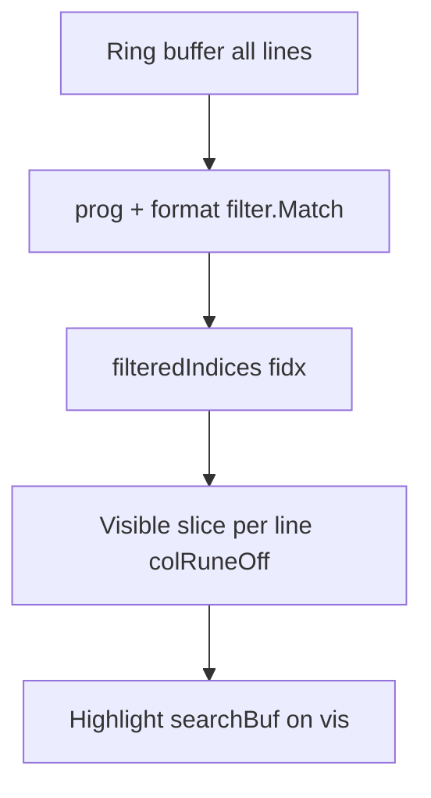

# 모드 스택(필터 × 하이라이트) 구현 계획

## 목적

[stdio-log-viewer-prd.md](stdio-log-viewer-prd.md) **§8.0**에 정의된 **레이어 스택**을 코드에서 **일관되게 유지·검증**한다.

- **레이어 1**: 필터 `prog` → 목록 인덱스 `fidx` (없으면 전체 줄).
- **레이어 2**: compose `Enter`로 확정된 **적용 검색어** `searchBuf` → 표시 줄의 가시 텍스트 하이라이트(**대소문자 구분** 매칭, PRD §8.2), **`Ctrl+n`/`Ctrl+p` 이동** 범위는 `fidx`만(순환 없음). 편집 중인 **검색 초안** `searchDraft`는 확정 전까지 하이라이트에 반영되지 않는다(PRD §8.1).

“모드 스택”은 별도 전역 스택 자료구조가 아니라, **데이터 흐름 순서**(필터 후 검색)와 **UI 상태 조합**(기본 탐색 / 필터 모드 × 하이라이트 on/off × 필터 입력 모드)으로 구현된다.

---

## 현재 구현 대 PRD 매핑

| PRD | 코드 위치 | 비고 |
|-----|------------|------|
| 레이어 1 목록 | [`filteredIndices`](internal/ui/model.go) | `filter.Match(..., m.prog, m.ignoreCase, detectLogFormat())` — `prog`가 비어 있으면 전 줄 통과(기본 탐색 모드와 동일). |
| 레이어 2 하이라이트 | [`formatLine` → `Highlight`](internal/ui/model.go) | `fidx[fi]`로 고른 줄의 **가시 슬라이스**에만 **적용 검색어** `searchBuf` 적용(초안 `searchDraft`는 미반영). |
| **`Ctrl+n`/`Ctrl+p` 이동** 범위 | [`gotoNextSearchHit` / `gotoPrevSearchHit`](internal/ui/model.go) | `fidx` 인덱스만 한 방향 스캔(끝에서 wrap 없음); `buf.At(fidx[j]).Text`로 매칭 — 필터 밖 줄은 후보에 없음. |
| 축 독립성 | `handleKey`, 필터 `Enter` / `clearAppliedFilter` | 필터 적용·해제 시 `searchBuf`를 건드리지 않음(의도 확인). 목록 `Esc` 다단계는 PRD §6.5·§6.6(검색만, 필터는 `Esc`로 해제하지 않음). 필터 **해제·재적용** 시 커서는 **동일 링 행**을 유지(`remapCursorPreservingRingRow`, PRD §6.4). |

**결론**: 핵심 스택 순서는 **이미 구현되어 있다**. 남은 일은 **회귀 방지**, **주석·테스트로 계약 고정**, **엣지 케이스 명시**다.

---

## 범위

### 포함

1. 코드베이스에 **§8.0과 동일한 순서**임을 짧은 주석으로 고정([`internal/ui/model.go`](internal/ui/model.go)의 `filteredIndices` 인근 또는 `Model` 필드 그룹).
2. **유닛 테스트** 추가: 기본 탐색 모드·필터 모드 각각에서 하이라이트·**`Ctrl+n`/`Ctrl+p`**(또는 `gotoNextSearchHit` 등 동등 경로)가 **레이어 1만** 대상으로 동작함을 given-when-then으로 검증.
3. (선택) `searchBuf` + `prog` 조합을 한 곳에서 설명하는 **짧은 내부 헬퍼 이름**은 도입하지 않음 — PRD가 단일 기준이면 주석+테스트로 충분(과도한 추상화 방지).

### 제외

- 필터 초안을 레이어 1 미리보기로 바꾸는 동작(현재 PRD: 입력 중 목록은 적용 `prog` 유지).
- TUI 라이브러리 교체.

---

## 작업 항목

1. **주석**  
   - `Model`의 `prog` / `searchBuf` / `filterEdit` 필드 위 또는 `filteredIndices` 직전에, “레이어 1 = filteredIndices, 레이어 2 = searchBuf on those lines, PRD §8.0” 2~4문장.

2. **테스트 파일**  
   - 예: [`internal/ui/model_stack_test.go`](internal/ui/model_stack_test.go) (신규).
   - **Case A (기본 탐색 + 하이라이트)**  
     - Given: 링에 `error`, `ok`, `error2` 등, `prog` 비어 있음, `searchBuf` = `error`.  
     - When: `gotoNextSearchHit` 또는 `Update`+**`Ctrl+n`** 키로 다음 매칭 이동(비순환).  
     - Then: 매칭은 **전체 목록**에서만; `error`가 없는 줄은 스킵.
   - **Case B (필터 + 하이라이트 스택)**  
     - Given: 줄 여러 개, `prog`가 일부만 통과(예: `+foo`), `searchBuf`가 그 부분집합의 일부에만 매칭.  
     - When: **`Ctrl+n`** 연속(또는 `gotoNextSearchHit` 직접 호출).  
     - Then: 방문 인덱스는 **필터 통과 줄**만; 통과하지만 검색에 안 맞는 줄은 스킵, 필터에 걸려 목록에 없는 줄은 절대 방문하지 않음.
   - **Case C (축 독립성)**  
     - Given: `searchBuf` 설정 후 필터 적용 또는 필터 해제.  
     - Then: 반대 축 문자열은 그대로(검색은 유지, 필터는 유지 등 PRD대로).

3. **문서**  
   - 본 계획서 하단에 “완료 조건” 체크리스트 유지.  
   - PRD §11 스택 관련 항목과 중복되면 PRD를 **수정하지 않고** 여기서 테스트 목록만 맞춘다.

---

## 데이터 흐름(참고)

키 입력·커서는 항상 `fidx` 인덱스 기준; **`Ctrl+n`/`Ctrl+p`**는 `SearchMatchesLine`을 `fidx` 위에서만 한 방향으로 호출하면 스택과 일치한다(순환 없음).

---

## 완료 조건

- [x] `internal/ui/model.go`(또는 동등 위치)에 **§8.0 레이어 순서** 주석이 있다.
- [x] `internal/ui`에 스택 동작을 검증하는 **유닛 테스트**가 추가되고 `go test ./...`가 통과한다.
- [x] 위 Case A·B는 필수, Case C는 필터 적용/해제 후 `searchBuf`·`appliedFilter` 조합을 최소 1시나리오로 검증한다.

---

## 일정·우선순위

1. 주석 (소요 적음).  
2. Case B 스택 테스트 (PRD 핵심).  
3. Case A, C.  

리스크: 낮음 — 동작 변경 없이 테스트·주석 위주일 가능성이 높다. 만약 테스트 중 스택 위반 버그가 나오면 해당 분기만 최소 수정한다.
